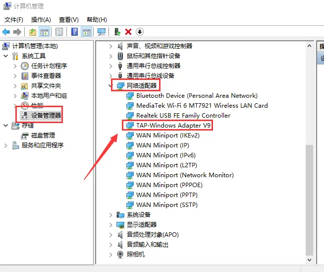
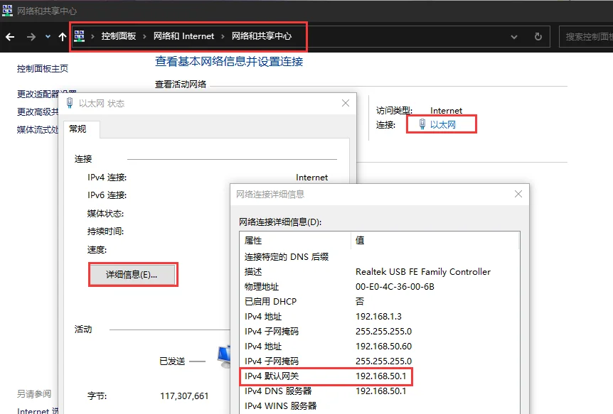
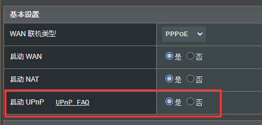

# 常见问题与解答

遇到问题时请先尝试**将软件更新至最新版本**，最新版本中通常包含更多的问题修复。

你也可以**加入我们的社群**寻求帮助，也许这个问题他人曾遇到过，且已经解决而未收录进本文档。

### 第一件事

**请先退出各类电脑管家以及杀毒软件！**

如果你没有安装杀毒软件，则检查 Windows Defender 是否拦截了软件的部分操作。

如果已经关闭上述软件，或**确保其不会拦截联机助手**的任何操作后，再次运行联机助手。

如果你还遇到问题，请继续阅读下文进行排查。

## 软件相关

### 软件打不开

请尝试以下步骤: 

#### 解除文件限制

1. 右键点击，打开“属性”
1. 勾选“解除锁定” (如果有)
1. 点击“确定”关闭属性窗口。

#### 使用管理员身份运行

右键点击，选择“使用管理员身份运行”

#### 检查是否被杀毒软件拦截

如果你的杀毒软件启用了“免打扰模式”，可能会拦截软件运行而不提醒。请检查你的杀毒软件。

### 获取更新和服务器信息失败

如果显示“获取更新和服务器信息失败”或者联机服务器持续显示“获取中”，请参考以下方法。

#### 如果你所在地区的运营商存在限制

如果你所在地区的运营商存在限制 (例如福建)，则可能无法正常获取更新信息。

这种情况下，请尝试进行[网络诊断与修复](./diagnostics.md)。

#### 设置DNS服务器

将 DNS 服务器设置为 223.5.5.5。

[图文设置教程](https://alidns.com/knowledge?type=SETTING_DOCS#user)

随后重启计算机。

#### 关闭杀毒软件

部分杀毒软件会拦截部分网络请求，你可以尝试暂时退出杀毒软件。

如果你安装了**火绒安全软件6.0**，请务必关闭其**加密连接扫描**功能或者暂时退出。

### 创建或加入房间后自动离开

### 无可用虚拟网卡

安装虚拟网卡。如果已经安装，请参考[下面的步骤](#虚拟网卡相关)进行虚拟网卡错误排查。

### 获取IP地址时卡住

左下角一直显示“正在获取IP地址”。通常更换联机服务器可以解决。

### 界面文字乱码

**解决方法**

### 登录失败，请重启客户端

重启软件后再试。如果问题依旧，说明当前选择的联机服务器处于维护状态。

### MAC或IP地址已被使用

通常是上一次使用该联机服务器后未正常退出导致地址资源未释放。

等待一段时间后重试，或者更换联机服务器。

## 联机网络与防火墙相关

### 特殊情况

如果联机双方位于不同国家，延迟通常会稍高。无论是P2P联机还是联机服务器中转。

### 退出冲突软件

如果你正在运行**同类软件**或**游戏加速器**，请先退出！

避免这些软件与联机助手发生冲突或影响后续判断。

### 无法Ping通对方

**成员端**左下角显示与房主端延迟测试超时，如“p:超时”。

首先尝试关闭**房主端防火墙**，如果关闭后问题依旧，参考下文。

双方可能网络环境受限无法建立 P2P 连接, 且联机服务器中转连接不佳。

此时需要**房间创建者**选择合适的[联机服务器](./server.md)进行中转。

### 与对方延迟太高

**成员端**左下角显示与房主端的延迟太高，如“p:XXms”。

双方可能网络环境受限无法建立 P2P 连接，此时可以选择合适的[联机服务器](./server.md)进行中转。

### 能够Ping通对方但是游戏无法连接

**成员端**左下角显示与房主端的延迟正常，如“p:XXms”，但是无法加入对方游戏。

#### 房主端防火墙拦截

通常是**房主端防火墙**拦截导致，可以尝试使用“关闭防火墙”按钮关闭系统防火墙。

**注意：这可能会带来潜在风险。**

#### 检查游戏联机信息

检查你的游戏联机信息 (例如地址、端口、房间密码等) 是否与房主设定的一致。

注意，**联机助手检测到的游戏联机信息仅供参考**！

如果房主在游戏内重新创建房间或者重启游戏，则房间信息中的联机信息可能失效。

请手动检查以确保联机信息无误。

#### 其他情况

如果**成员端**左下角延迟显示正常，且已经参考本文内容进行排查，但仍然无法加入对方游戏，则你需要考虑是否其他因素影响了游戏联机。

例如: 游戏模组冲突等。

## 虚拟网卡相关

如果已安装虚拟网卡驱动，但软件仍然提示**无可用虚拟网卡**，请按以下步骤检查。

打开**设备管理器**，查看**网络适配器**中是否有 `TAP-Windows Adapter V9`。

正常情况应该如上图所示。如果设备前显示**感叹号**，请双击查看**设备状态**并按照下文说明继续排查。

如果设备前显示**下箭头**，说明虚拟网卡被禁用，右键点击启用即可。

### 驱动签名问题

如果显示 **Windows 无法验证此设备所需的驱动程序的数字签名**，请先卸载当前版本。

然后手动安装 `tap-windows-9.21.2.exe` 即可。

### 注册表无用项问题

如果显示 **Windows 仍在设置此设备的类配置**，请使用 **CCleaner** 清理注册表。

清理后重启计算机。

## 网络相关

### NAT 类型

你可以在软件主界面的右下角查看当前的网络状况。

如果显示为橙色空心圆 ○，则有很大可能是你的路由器设备存在限制。

你可以参考下文的[路由器设置教程](#路由器设置教程)改善。

如果显示为**黑色空心圆 ○**，则无法与**同类用户**建立P2P连接。

如要改善 NAT 类型，你可以尝试在路由器管理页面中进行一些设置。

### 本侧网络连接可能受阻

**Tip: 建议以软件主界面右下角显示的网络状况为准**

说明路由器设备可能不支持 NAT-PMP 或 UPnP。

你可以尝试在路由器管理页面中启用相关选项。

### 路由器设置教程

如果软件右下角显示的网络状况不佳，你可以尝试在路由器后台进行部分设置来改善联机体验。

#### 登录路由器管理

先查看路由器的IP地址

记下该地址，并在浏览器地址栏中输入

输入管理账号与密码，登录路由器后台。

#### 启用 UPnP

找到标有 `UPnP` 的设置选项，不同厂商的路由器页面可能略有不同。

将 `UPnP` 功能启用。

[TP-LINK 官方设置教程](https://resource.tp-link.com.cn/pc/docCenter/showDoc?id=1655112527113938)

[华为路由器官方设置教程](https://consumer.huawei.com/cn/support/content/zh-cn00225379/)

#### 设置 DMZ 主机

Tip: 在设置 DMZ 主机前，建议为你的设备设置静态内网IP地址或者在DHCP设置中指定本机的内网IP。

[TP-LINK 官方设置教程](https://security.tp-link.com.cn/service/detail_article_2442.html)

[华为路由器官方设置教程](https://consumer.huawei.com/cn/support/content/zh-cn00225378/)
